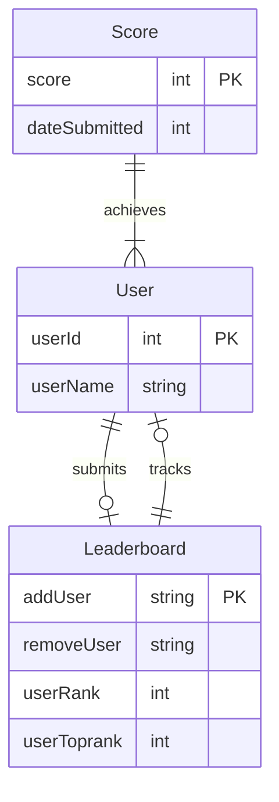

# Leaderboard Tracker
This application allows the users to submit scores for a game to a database.
## Feature List
* Required Features
  * TODO
* Should Have Features
  * TODO
* Nice to Have Features
  * TODO
## User Stories
1. As a user, I want to see my rank on the leaderboard even if I'm not in the top 10, so I can track my own progress.
2. As a user, I want to view the leaderboard so that I can see how I rank amongst others.
3. As a user, I want to submit my score so that I can be added to the leaderboard.
4. As a user, I want to be notified when my score moves in the leaderboard.
5. As a user, I want to share my rank on social media so I can brag about my achievements.
## Database Schema (ERD)

---
       
## User Flow Diagram
TODO
## List of Endpoints
TODO
