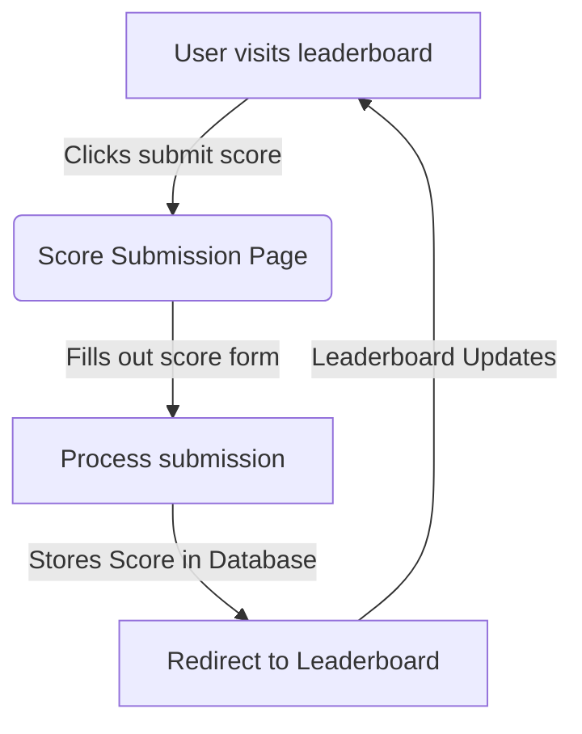

# Leaderboard Tracker
This application allows the users to submit and track scores for a game to a database.
## Feature List
* Required Features
  * Display a leaderboard of scores
  * Submission of scores
* Should Have Features
  * User verification of scores
  * Validation of score ranges
  * Score removal
  * Score updating
* Nice to Have Features
  * Separate scoreboards for multiple games
  * Categories per game, per scoreboard
## User Stories
1. As a user, I want to see my rank on the leaderboard even if I'm not in the top 10, so I can track my own progress.
2. As a user, I want to view the leaderboard so that I can see how I rank amongst others.
3. As a user, I want to submit my score so that I can be added to the leaderboard.
4. As a user, I want to be notified when my score moves in the leaderboard.
5. As a user, I want to share my rank on social media so I can brag about my achievements.
## Database Schema (ERD)

---
       
## User Flow Diagram

## List of Endpoints
<!-- This can be subject to change as we work on our project -->
This section outlines the API and frontend routes used in the leaderboard system.

### Frontend Routes (User-Accessible Pages)

| Method | Endpoint  | Description | Expected Input | Response |
|--------|----------|-------------|----------------|----------|
| GET    | `/`      | Displays the leaderboard scores | None | Renders `leaderboard.html` with scores |
| GET    | `/submit` | Displays the score submission form | None | Renders `submit.html` |

### API Routes (Data Handling via JSON)

| Method | Endpoint      | Description | Expected Input | Response |
|--------|--------------|-------------|----------------|----------|
| GET    | `/api/scores` | Gets all scores in JSON format | None | `{ "scores": [{"name": "Alice", "score": 100}, ...] }` |
| POST   | `/api/scores` | Submits a new score via JSON | `{ "name": "Alice", "score": 100 }` | `{ "success": true, "message": "Score added!" }` |

### Form Handling Route

| Method | Endpoint  | Description | Expected Input | Response |
|--------|----------|-------------|----------------|----------|
| POST   | `/submit` | Handles form submission for scores | `name`, `score` (Form Data) | Redirects to `/` |

---

### Additional Notes
- The **Leaderboard Page (`/`)** fetches and displays scores.
- The **Score Submission Page (`/submit`)** will allow users to enter their name and score.
- The **API endpoints (`/api/scores`)** enables external data interaction.
- The app uses **Flask and SQLite** for backend processing.
